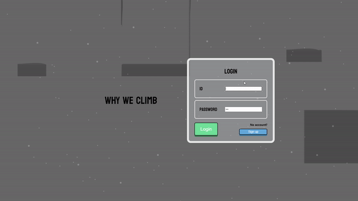
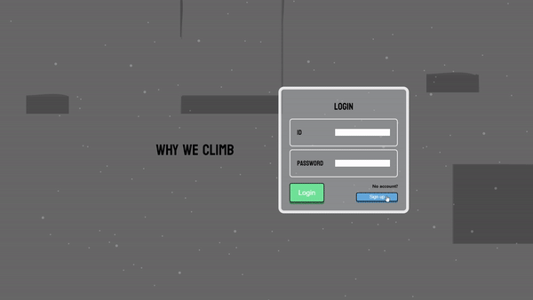
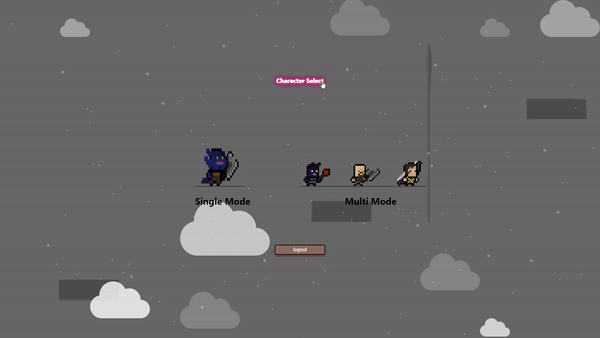
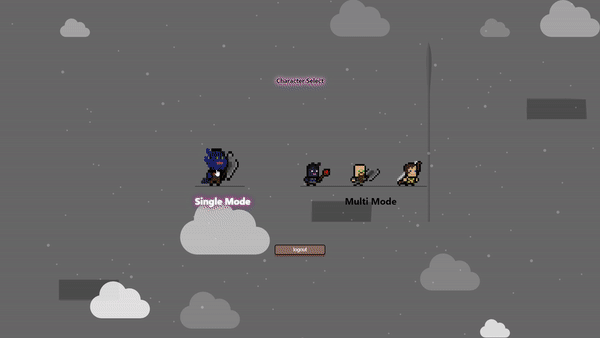
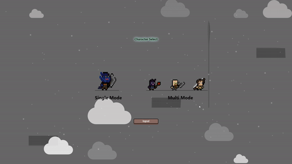
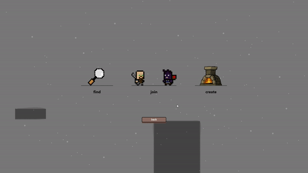
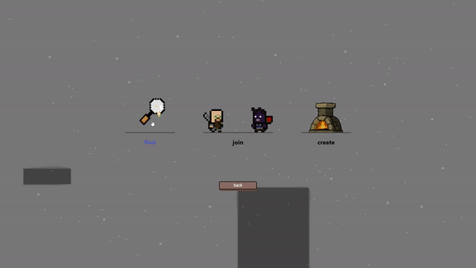

# Why We Climb

#### 가볍게 즐기는 웹 게임

> 웹에서 가볍게 킬링타임용으로 즐길 수 있는 게임
>
> > 점프킹을 모티브로 삼아 멀티플레이로 경쟁이 가능하도록 구현
> >
> > 멀티플레이에서는 루즈함을 해소하기 위해 맵 순서를 섞이도록 만들어 매번 다른 경험을 할 수 있게 구현

##### ✨팀구성✨

 - 우 윤 석   ⇒   팀장, frontend & game modeling

 - 김 태 훈   ⇒   팀원, frontend & front design

 - 정      찬   ⇒   팀원, frontend  & webSocket front

 - 김 민 준   ⇒   팀원, backend & devOps

 - 류 대 성   ⇒   팀원, backend & webSocket

##### 개발 일정

2022.04.11~2022.05.27 (총 7주)
 - 04/11 ~ 04/17 - 기획 (1주) 
 - 04/18 ~ 05/19 - 개발 (약 5주)
 - 05/20 ~ 05/27 - 발표 자료 작성, 회고 (약 1주)

## 실제 서비스 화면

##### 로그인

##### 회원가입

##### 캐릭터 선택

##### 싱글 플레이 화면

##### 멀티모드 진입 후 방 생성

##### 랜덤 방 진입

##### 코드를 입력하여 방 진입

##### 대기실에서 start 버튼을 눌러 멀티 게임 시작

## 개발 환경
### 아키텍처

### Front-End

-  - 

- Node.js - `v14.15.1`
- Next.js - `12.1.5`
- npm - `v6.14.8`

### Back-End

- Java - `openjdk v1.8.0_301`
- Spring Boot - `2.6.6`
- JPA 
- Mysql - `8.0.27`
- Swagger - `v3`

### Infra

- AWS EC2
- Jenkins - `jenkins:lts 2.332.2`
- Nginx - `1.18.0 (ubuntu)`
- Cerbot - `1.27.0`
- Docker - `20.10.14`

### Port

| App     | EC2 Port | 컨테이너 Port |
| ------- | -------- | ------------- |
| Spring  | 8081     | 8081          |
| Next.js | 3000     | 3000          |
| MySQL   | 3306     | 3306          |
| Jenkins | 8080     | 8080          |

## 산출물

[피그마](https://www.figma.com/file/5ZuRhHHbmY3zTjiBFekLZD/Why-we-Climb%3F?node-id=0%3A1)

[페이지 명세서](https://www.notion.so/b4c17f0db26a42d1a9f28a6645283855)

[포팅 메뉴얼](https://www.notion.so/6c4d10bdaefe4a0ba29658dc655505cf)

[디자인 근거들](https://www.notion.so/db86bff5eb4c4c6da3f7dcea7bf658c5)

#### 컨벤션

* [HTML/CSS](https://www.notion.so/HTML-CSS-f551d6dc19bc4090a88e69f6b3926300)
* [Javascript](https://www.notion.so/JavsScript-c1e8d67430754b52b8b489614db28246)
* [react/JSX/nextjs](https://www.notion.so/react-JSX-nextjs-a87e0d1e0ac449b6b510d6824fa173e9)
* [java](https://www.notion.so/java-code-ace7e3db56cd4019aaca63603963ea24)
