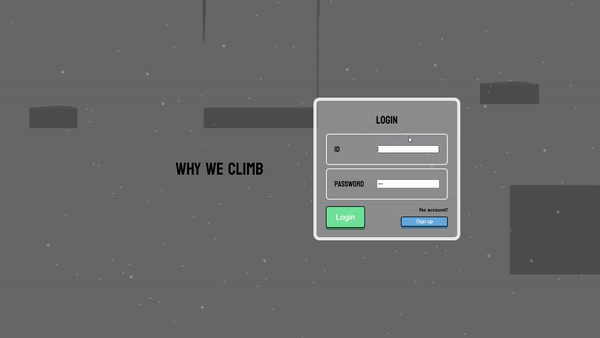
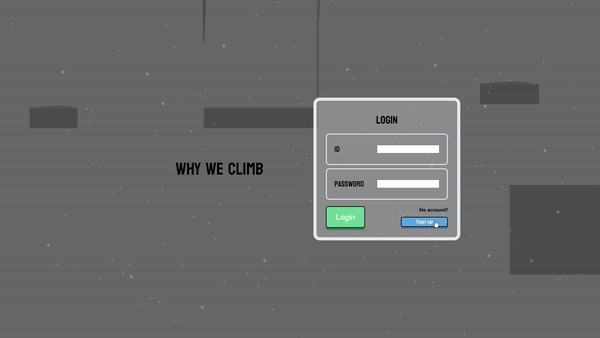
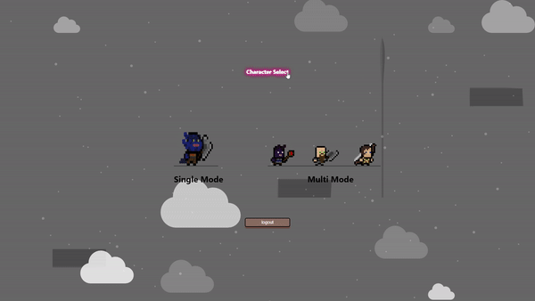
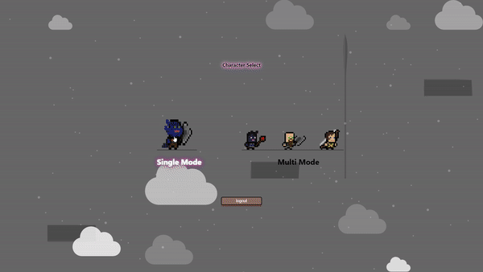
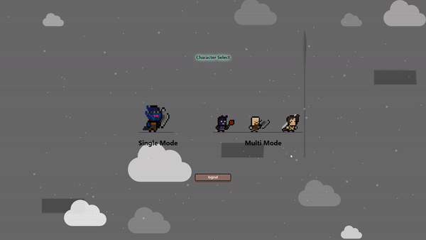
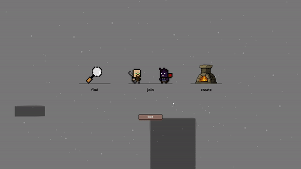
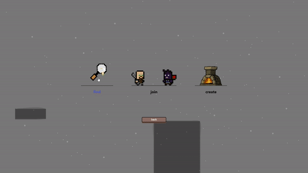
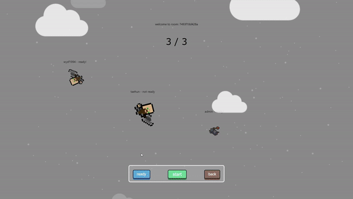

# Why We Climb

#### 가볍게 즐기는 웹 게임

> 웹에서 가볍게 킬링타임용으로 즐길 수 있는 게임
>
> > 점프킹을 모티브로 삼아 멀티플레이로 경쟁이 가능하도록 구현
> >
> > 멀티플레이에서는 루즈함을 해소하기 위해 맵 순서를 섞이도록 만들어 매번 다른 경험을 할 수 있게 구현

##### ✨팀구성✨

 - 우 윤 석   ⇒   팀장, frontend & game modeling

 - 김 태 훈   ⇒   팀원, frontend & front design

 - 정      찬   ⇒   팀원, frontend  & webSocket front

 - 김 민 준   ⇒   팀원, backend & devOps

 - 류 대 성   ⇒   팀원, backend & webSocket


##### 개발 일정

2022.04.11~2022.05.27 (총 7주)
 - 04/11 ~ 04/17 - 기획 (1주) 
 - 04/18 ~ 05/19 - 개발 (약 5주)
 - 05/20 ~ 05/27 - 발표 자료 작성, 회고 (약 1주)


## 실제 서비스 화면

##### 로그인


##### 회원가입



##### 캐릭터 선택



##### 싱글 플레이 화면



##### 멀티모드 진입 후 방 생성



##### 랜덤 방 진입



##### 코드를 입력하여 방 진입



##### 대기실에서 start 버튼을 눌러 멀티 게임 시작




## 개발 환경
### 아키텍처


### Front-End

-  - `v14.15.1`
-  - `12.1.5`
-  - `v6.14.8`

### Back-End

-  - `openjdk v1.8.0_301`
-  - `2.6.6`
-  - `8.0.27`
-  - `v3`
- 

### Infra

-  
-  - `jenkins:lts 2.332.2`
-  - `1.18.0 (ubuntu)`
-  - `20.10.14`
-  - `1.27.0`

### Port

| App     | EC2 Port | 컨테이너 Port |
| ------- | -------- | ------------- |
| Spring  | 8081     | 8081          |
| Next.js | 3000     | 3000          |
| MySQL   | 3306     | 3306          |
| Jenkins | 8080     | 8080          |


## 보안 및 코드 품질 개선

초기 개발 이후 소스코드 분석을 통해 발견된 보안 취약점 및 코드 품질 문제를 개선했습니다.

### 보안 개선

#### 시크릿 키 환경변수 분리
**문제:** DB 접속 정보, JWT 시크릿, Jasypt 암호화 키, Redis 호스트 등 민감한 정보가 `application.yml`과 소스 코드에 하드코딩되어 있었습니다. 소스 코드 노출 시 서버 전체가 위협받을 수 있는 상태였습니다.

**해결:** 모든 민감 정보를 `${ENV_VAR}` 환경변수 참조로 교체했습니다. `backend/.env.example`에 필요한 환경변수 목록을 문서화했습니다.

```
DB_URL / DB_USERNAME / DB_PASSWORD
REDIS_HOST / REDIS_PORT
JWT_SECRET
JASYPT_ENCRYPTOR_PASSWORD
CORS_ALLOWED_ORIGINS
```

#### 패스워드 해싱 알고리즘 교체 (SHA-256 → BCrypt)
**문제:** `SecurityService`가 단순 SHA-256 + 고정 솔트로 패스워드를 해싱하고 있었습니다. SHA-256은 속도가 빠른 해시 함수로 GPU 브루트포스 공격에 취약합니다.

**해결:** Spring Security의 `BCryptPasswordEncoder`로 교체했습니다. BCrypt는 의도적으로 느린 알고리즘으로 설계되어 브루트포스 공격 비용을 대폭 높입니다.
- `encode(rawPassword)` — 회원가입 시 패스워드 저장
- `matches(rawPassword, encodedHash)` — 로그인 시 검증 (평문 비교 쿼리 제거)

> **주의:** 기존 SHA-256으로 저장된 패스워드는 BCrypt와 호환되지 않으므로, 운영 DB 적용 시 기존 사용자 패스워드 초기화 또는 마이그레이션 스크립트가 필요합니다.

#### Jasypt 암호화 알고리즘 업그레이드
**문제:** `PBEWithMD5AndDES` 알고리즘을 사용하고 있었습니다. MD5는 충돌 취약점이 알려져 있고 DES는 56비트 키로 현재 기준 안전하지 않습니다.

**해결:** `PBEWITHHMACSHA512ANDAES_256`으로 교체했습니다. SHA-512 HMAC + AES-256은 현재 권장되는 대칭 암호화 방식입니다.

#### CORS 전체 허용 제한
**문제:** `WebConfig`에서 `.allowedOrigins("*")`로 모든 도메인의 요청을 허용하고 있었습니다. 자격 증명(쿠키, Authorization 헤더)을 함께 허용할 경우 CSRF 공격에 노출될 수 있습니다.

**해결:** `CORS_ALLOWED_ORIGINS` 환경변수에서 허용 도메인을 읽도록 변경하고 `allowCredentials(true)`를 활성화했습니다. WebSocket 엔드포인트(`/ws-stomp`)도 동일하게 환경변수 기반으로 통일했습니다.

#### JWT 초기화 버그 수정
**문제:** `JwtTokenProvider`에서 `private final Key SECRET_KEY = Keys.hmacShaKeyFor(secret.getBytes())`가 `@Value` 주입 이전에 실행되어, `secret`이 `null`인 상태로 Key 객체가 생성되는 NPE 버그가 존재했습니다.

**해결:** `secretKey` 필드를 `@PostConstruct`로 이동하여 `@Value` 주입 완료 후 Base64 디코딩으로 안전하게 초기화합니다.

#### Spring Security `getAuthorities()` null 반환 수정
**문제:** `User` 엔티티의 `getAuthorities()`가 `null`을 반환하고 있었습니다. Spring Security 인가 처리에서 권한 목록이 null이면 `NullPointerException` 또는 인가 우회가 발생할 수 있습니다.

**해결:** `Collections.singletonList(new SimpleGrantedAuthority("ROLE_USER"))`를 반환하도록 수정했습니다.

#### 프론트엔드 API URL 환경변수화
**문제:** 10개 파일에 `https://k6a401.p.ssafy.io/api`가 하드코딩되어 있었습니다. 도메인 변경 시 전체 파일을 일일이 수정해야 하며, 로컬 개발 환경에서도 동작하지 않습니다.

**해결:** `NEXT_PUBLIC_API_URL` 환경변수로 통일했습니다. `front/.env.local.example`을 참고해 `.env.local` 파일을 생성하세요.

```env
# front/.env.local
NEXT_PUBLIC_API_URL=https://your-domain.com/api
```

---

### 코드 품질 개선

#### WebSocket 세션 고아 방지
**문제:** Redis에 저장되는 `Access`(세션-방 매핑) 엔티티에 TTL이 없어, 네트워크 단절 등으로 DISCONNECT 이벤트가 누락되면 세션이 영구적으로 남아 방 정원이 복구되지 않는 문제가 있었습니다.

**해결:** `@RedisHash(timeToLive = 7200)`으로 2시간 TTL을 설정했습니다. 또한 `getReady()`, `roomStatus()`, `outGameRoom()` 등에서 `Optional.get()`/`Objects.requireNonNull()` 대신 null 안전 처리를 적용했습니다.

#### 입력값 검증 추가
**문제:** 모든 요청 DTO에 서버 사이드 입력 검증이 없어 잘못된 데이터가 그대로 DB에 저장될 수 있었습니다.

**해결:** Jakarta Validation 어노테이션을 DTO에 추가하고 컨트롤러에 `@Valid`를 적용했습니다.

| DTO | 검증 내용 |
|-----|----------|
| `UserRequest` | userId 영숫자 3~20자, password 8~100자 |
| `UserUpdateRequest` | userSeq not null, 볼륨 0~100, 스킨 1~4 |
| `RoomCreateRequest` | 필드 not null, 최대 인원 2~4명 |
| `UserRecordUpdateRequest` | userSeq not null, 레벨·기록 0 이상 |

#### joinRoom N+1 쿼리 최적화
**문제:** `RoomServiceImpl.joinRoom()`에서 후보 방 목록(최대 10개)을 가져온 뒤, 루프 안에서 각 방마다 Redis를 개별 조회하는 N+1 패턴이 있었습니다.

**해결:** `accessRedisRepo.findAll()`로 전체 세션을 1회 조회한 뒤 `stream().collect(groupingBy(roomCode, counting()))`로 방별 현재 인원을 메모리에서 집계합니다. Redis 조회 횟수가 N → 1로 줄었습니다.

#### URL 타이포 버그 수정
**문제:** `[roomID].js`의 `useEffect` cleanup 함수에서 `${basicURL}}/exit/${sessionId}`에 중괄호가 하나 더 있어(`}}`), 페이지 이탈 시 퇴장 처리 API가 실제로 호출되지 않았습니다.

**해결:** `${basicURL}/exit/${sessionId}`로 수정했습니다.

#### 기타 정리
- `==` → `===` 엄격한 비교 교체 (`engine.js` 8개소)
- 활성 `console.log` 제거 (게임 상태, 세션 ID 노출 방지)
- `UserInterceptor`, `WebSockConfig`, `MessageController`의 미완성 주석 코드 제거

---

## 산출물

[피그마](https://www.figma.com/file/5ZuRhHHbmY3zTjiBFekLZD/Why-we-Climb%3F?node-id=0%3A1)

[ERD](https://www.notion.so/ERD-f4c2842d1a9a4efd805611dd2bb2bd6a)

[페이지 명세서](https://www.notion.so/b4c17f0db26a42d1a9f28a6645283855)

[포팅 메뉴얼](https://www.notion.so/6c4d10bdaefe4a0ba29658dc655505cf)

[디자인 근거들](https://www.notion.so/db86bff5eb4c4c6da3f7dcea7bf658c5)

#### 컨벤션

* [HTML/CSS](https://www.notion.so/HTML-CSS-f551d6dc19bc4090a88e69f6b3926300)
* [Javascript](https://www.notion.so/JavsScript-c1e8d67430754b52b8b489614db28246)
* [react/JSX/nextjs](https://www.notion.so/react-JSX-nextjs-a87e0d1e0ac449b6b510d6824fa173e9)
* [java](https://www.notion.so/java-code-ace7e3db56cd4019aaca63603963ea24)
